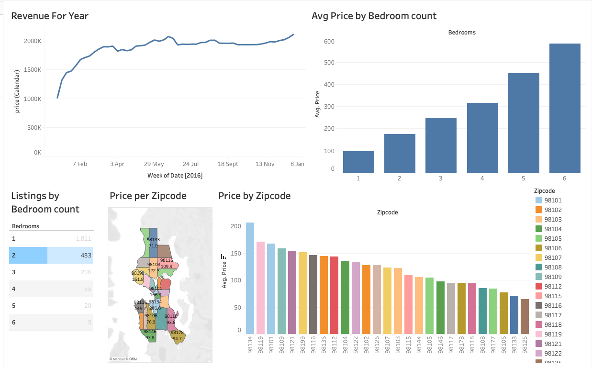

# Seattle Airbnb Listings — Tableau Dashboard (2016)

A practice Tableau project exploring the Seattle Airbnb market using the publicly available 2016 dataset. The goal was to get comfortable building dashboards in Tableau by working with a real-world dataset that includes pricing, availability, and listing details.

---

## Dashboard Preview

---

## Dataset

**Source:** Airbnb Seattle Open Data (2016)
**Tables used:**

| Table | Description |
|---|---|
| `listings` | Details on each Airbnb property (price, bedrooms, zipcode, etc.) |
| `calendar` | Daily availability and pricing across the year |
| `reviews` | Guest reviews associated with each listing |

---

## Dashboard Sheets

### 1. Price by Zipcode (Bar Chart)
Compares average Airbnb listing prices across Seattle zip codes. Useful for identifying which neighbourhoods command a price premium.

### 2. Price by Zipcode (Map)
The same price-by-zipcode data visualised geographically. Gives a spatial sense of how pricing is distributed across the city.

### 3. Revenue for Year (Line Chart)
Tracks estimated revenue trends across all 52 weeks of 2016, plotted in intervals of 5 weeks. Shows seasonal demand patterns throughout the year.

### 4. Average Price by Bedroom Count
Shows how average nightly price scales with the number of bedrooms. Key insight: 1-bedroom listings have the lowest average price but generate the highest total yearly revenue, while 6-bedroom listings have the highest average price but lowest yearly revenue — likely due to fewer bookings.

### 5. Listings by Bedroom Count (Table)
A competition table showing how many listings exist per bedroom count. Highlights market saturation — 1-bedroom listings dominate supply, while 6-bedroom listings number only 5.

---

## Files in This Repo

| File | Description |
|---|---|
| `seattle_airbnb_dashboard.twbx` | Tableau packaged workbook (all sheets + dashboard) |
| `dashboard.png` | Screenshot of the final dashboard |
| `README.md` | This file |

---

## Tools Used

- **Tableau Public** — data visualisation and dashboard design
- **Dataset** — [Seattle Airbnb Open Data on Kaggle](https://www.kaggle.com/datasets/airbnb/seattle)

---

## Notes

This is a personal learning project built to practise Tableau fundamentals — connecting data sources, building calculated fields, and composing a multi-sheet dashboard. Not intended for production use.
